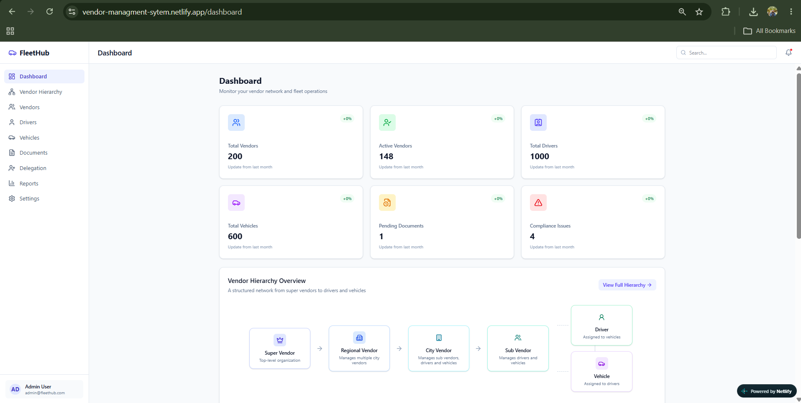
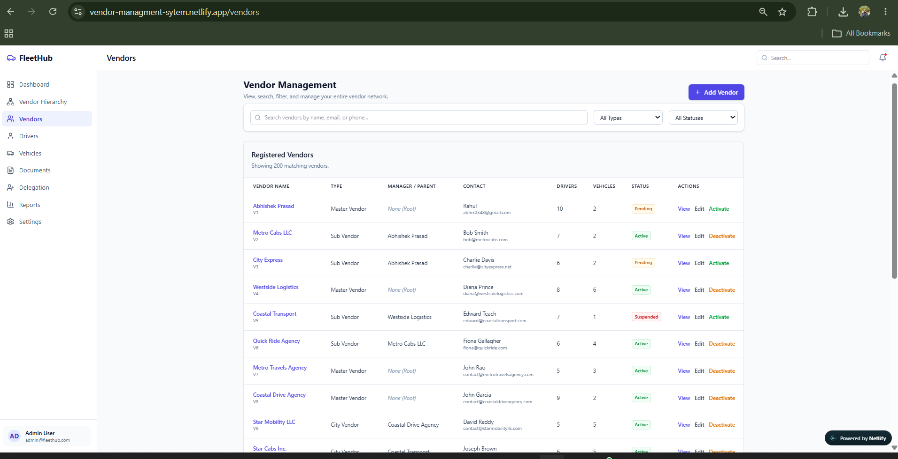
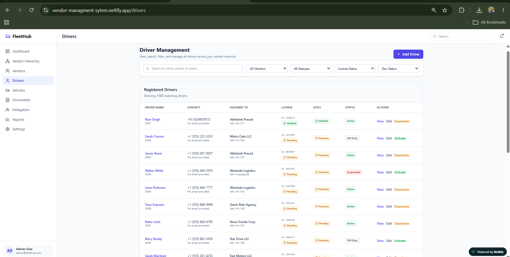
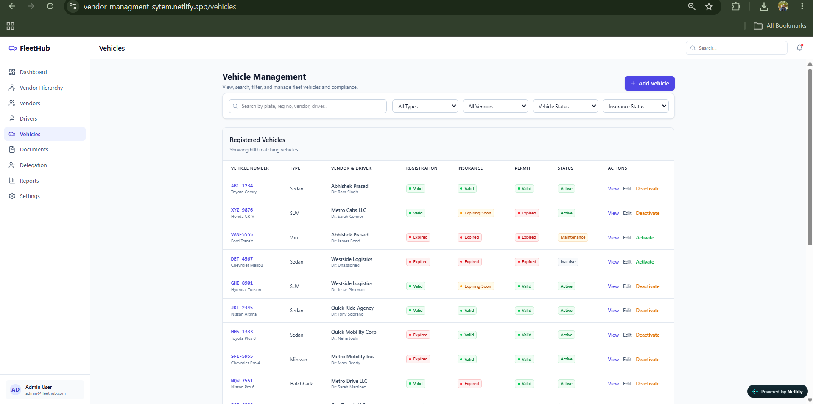
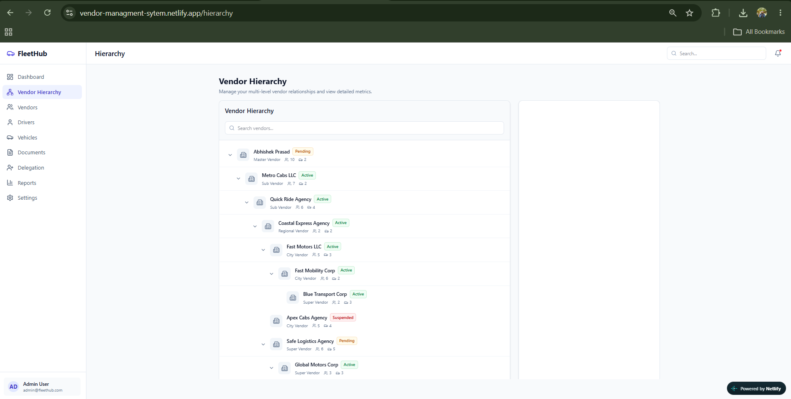
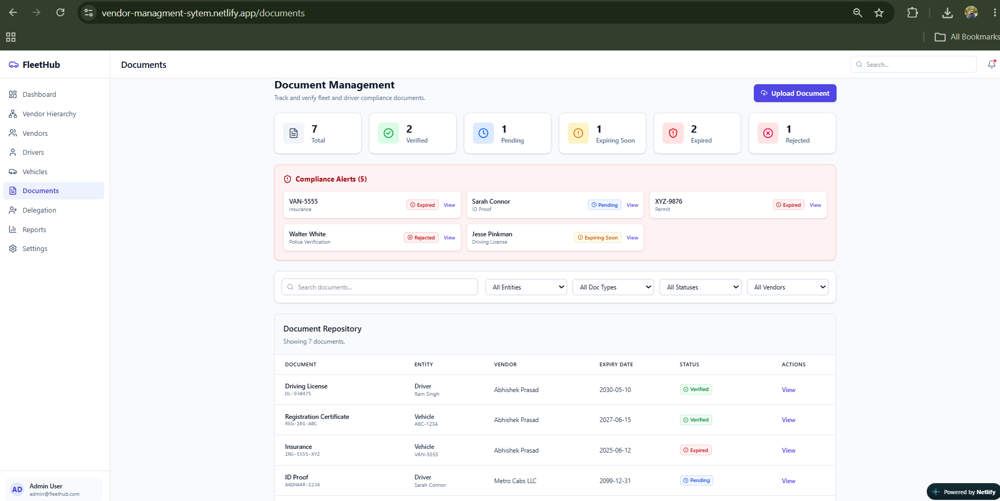
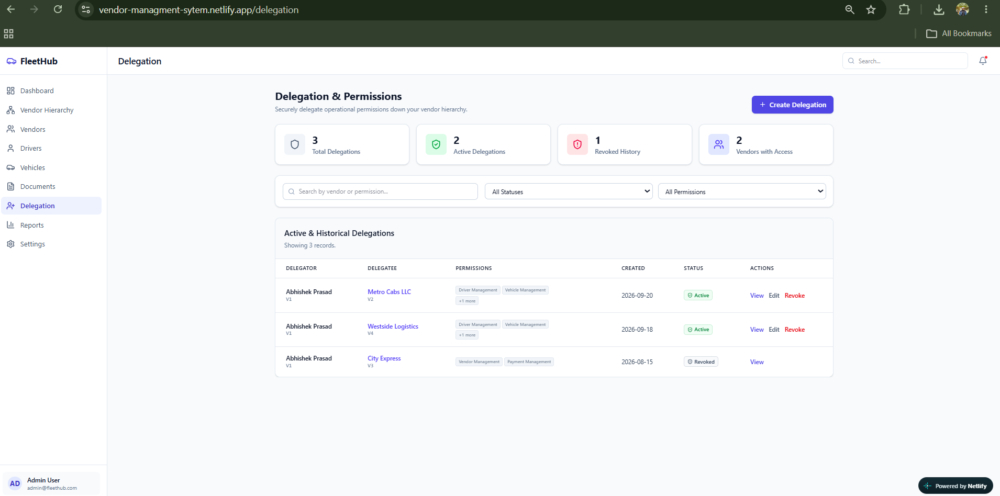
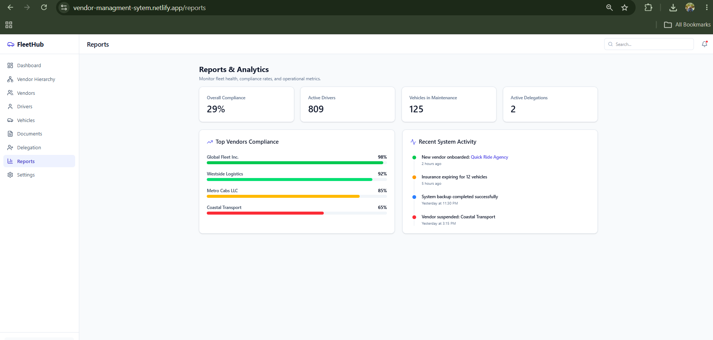
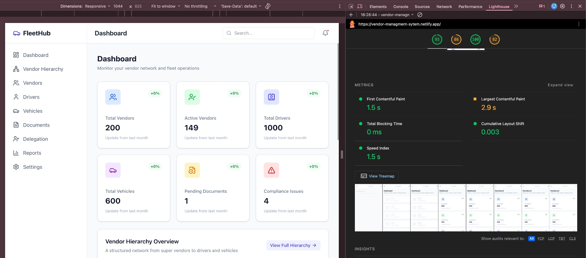
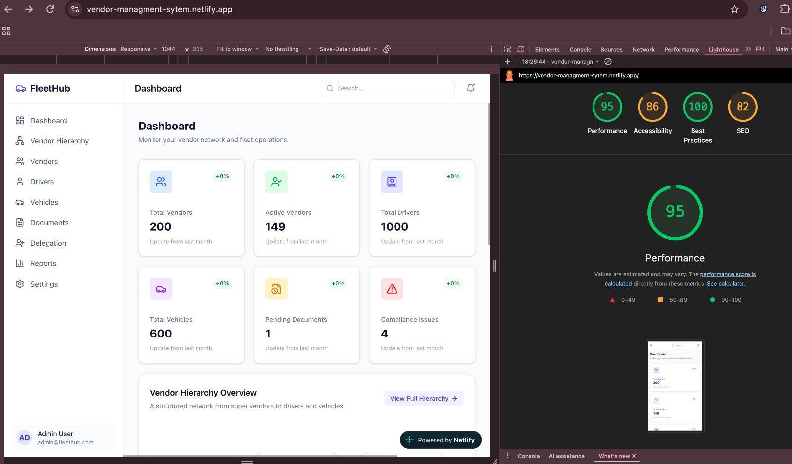

# Vendor Management System

Vendor Management System is a responsive, professional frontend application designed to streamline the management of cab vendors, drivers, vehicles, organizational hierarchy, compliance documents, delegation, and reporting. Built for operational efficiency, it features a clean and interactive user interface to handle complex datasets and nested vendor relationships seamlessly.

## Live Demo
[https://vendor-managment-sytem.netlify.app/](https://vendor-managment-sytem.netlify.app/)

## Features

- **Dashboard with Dynamic Metrics**: Overview of fleet operations, compliance issues, and recent activities.
- **Vendor Management**: Add, edit, and track vendors across multiple organizational levels.
- **Driver Management**: Manage driver details, assignments, licenses, and duty status.
- **Vehicle Management**: Track fleet vehicles, maintenance status, and assignment details.
- **Vendor Hierarchy**: Visualize and manage complex multi-level vendor relationships in a tree structure.
- **Move User Functionality**: Seamlessly reassign users across the hierarchy with validation.
- **Documents & Compliance**: Track expirations, verify or reject uploads, and maintain compliance standards.
- **Delegation & Permissions**: Securely delegate responsibilities and specific permissions between hierarchy members.
- **Reports**: Analytics overview of overall compliance, driver statuses, and vehicle maintenance.
- **Settings**: Manage profile preferences, notifications, and security settings.
- **Global Search**: Instantly find records across the system.
- **Search and Filtering**: Advanced filtering and search for targeted data retrieval.
- **Pagination for Large Datasets**: Efficient rendering of large mock datasets.
- **Responsive UI**: Optimized layout for desktop, tablet, and mobile devices.
- **LocalStorage Persistence**: Application state is saved locally in the browser.
- **Empty States and Validation**: Robust handling of zero-record states and comprehensive form validations.
- **Confirmation Dialogs and User Feedback**: Interactive modals and toast notifications for user actions.

## Vendor Hierarchy

The application supports a robust multi-tier organizational structure:

Super Vendor
→ Regional Vendor
→ City Vendor
→ Sub Vendor / Driver / Vehicle

Moving a user or vendor within the hierarchy includes strict validation to prevent invalid relationships, such as moving an entity under itself, assigning it to one of its own descendants, or re-assigning it to its current parent.

## Large Dataset & Pagination

To demonstrate performance and data handling, the frontend includes realistic, pre-generated mock datasets:
- 200 vendors
- 1000 drivers
- 600 vehicles
- 7 documents

Search and filtering operations are performed on the entire dataset *before* pagination is applied, ensuring accurate results while maintaining smooth performance for large lists. *(Note: This data is generated for demonstration purposes and does not represent real production data).*

## Performance

Performance was measured with Lighthouse in Chrome DevTools against the deployed build in desktop mode. The application scored **95 for Performance**, **86 for Accessibility**, **100 for Best Practices** and **82 for SEO**, with the following Core Web Vitals:

- **First Contentful Paint — 1.5 s**
- **Largest Contentful Paint — 2.9 s**
- **Total Blocking Time — 0 ms**, confirming the main thread stays free during the tested Lighthouse run with 1000 drivers held in memory. This is supported by capping tables at 20 rows per page and debouncing search input.
- **Cumulative Layout Shift — 0.003**, indicating minimal visible layout movement during the tested run, with skeleton loaders occupying the same space as the content they replace.
- **Speed Index — 1.5 s**

Largest Contentful Paint is the weakest performance metric in the tested run, as the application currently ships as a single JavaScript bundle that must be parsed before the dashboard paints. Route-level code splitting using `React.lazy` is an intended future optimization.

The lower Accessibility and SEO scores are not performance-related: a few colour combinations fall below the required contrast ratio, and the page currently lacks a meta description. The SPA redirect configuration also serves `/robots.txt`.

## Documents & Compliance

The system includes a comprehensive compliance flow to track document statuses, expiry dates, and verification logic. Administrators can simulate document uploads, manually verify or reject submissions, and monitor expiring licenses. 

*(Note: File uploads are simulated entirely within the frontend and are not transmitted to any server).*

## Delegation & Permissions

The delegation system allows users to assign specific permissions to other vendors or users within the hierarchy. This feature includes validation to ensure delegations are only made within valid hierarchical bounds, prevents duplicate or self-delegation, and includes functionality to revoke permissions while maintaining a history of actions.

## Data Persistence

Application data is persisted entirely using the browser's `localStorage`. All updates, additions, or deletions made during your session will remain intact upon refreshing the page. 

Clearing your browser's local storage will reset the application data back to its initial generated mock dataset.

## UI/UX

The interface is built with a focus on a premium user experience:
- Responsive design tailored for all screen sizes
- Intuitive sidebar navigation
- Responsive data tables
- Accessible search and filter controls
- Skeleton loading states for perceived performance
- Smooth hover effects and transitions
- Animated modal entrances and exits
- Ripple click feedback on interactive elements
- Clear, helpful empty states
- Reduced-motion considerations for accessibility

## Tech Stack

| Technology | Description |
| :--- | :--- |
| **React** | UI Component Library |
| **Vite** | Next Generation Frontend Tooling |
| **JavaScript** | Core Programming Language |
| **Tailwind CSS** | Utility-First CSS Framework |
| **React Router** | Client-Side Routing |
| **Lucide React** | Consistent, Beautiful Iconography |
| **Context API** | Global State Management |
| **LocalStorage** | Browser-Based Data Persistence |

## Project Structure

```text
src/
├── components/
├── pages/
├── data/
├── context/
├── utils/
├── hooks/
├── App.jsx
├── main.jsx
└── index.css
```

## Getting Started

To run this project locally:

```bash
git clone https://github.com/imabhishek86/Vendor_Managment_System
cd <project-folder>
npm install
npm run dev
```

To build the project for production:

```bash
npm run build
```

## Production Deployment

This project is deployed on Netlify. It includes Single Page Application (SPA) routing support using a `public/_redirects` file configured with the standard Netlify fallback (`/* /index.html 200`).

## Screenshots

### Dashboard


### Vendor Management


### Driver Management


### Vehicle Management


### Vendor Hierarchy


### Documents & Compliance


### Delegation & Permissions


### Reports


## Lighthouse Performance

The application was also tested using Google Lighthouse to evaluate performance, accessibility, best practices, and SEO.

### Lighthouse Test 1


### Lighthouse Test 2


## Limitations

- This is a frontend-only application.
- Data is mock/generated.
- Persistence relies solely on browser `localStorage`.
- File uploads are simulated and not processed securely.
- Authentication and security features are UI-level only.
- There is no backend server or database integration.

## Future Enhancements

Potential improvements for a production release:
- Node.js/Express backend integration
- MongoDB or PostgreSQL database
- JWT-based authentication
- Role-based server-side authorization
- Cloud file storage integration (e.g., AWS S3)
- Real-time notifications via WebSockets
- Comprehensive audit logs
- Production API integration

## Author

Abhishek Prasad
